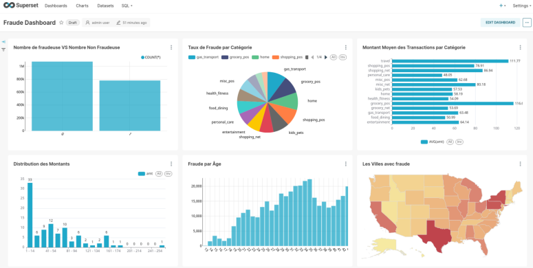
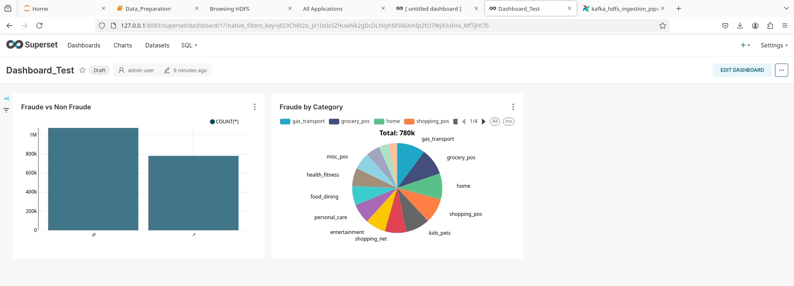
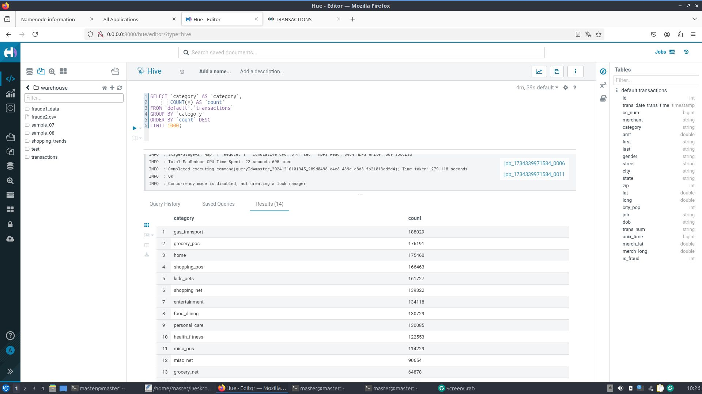
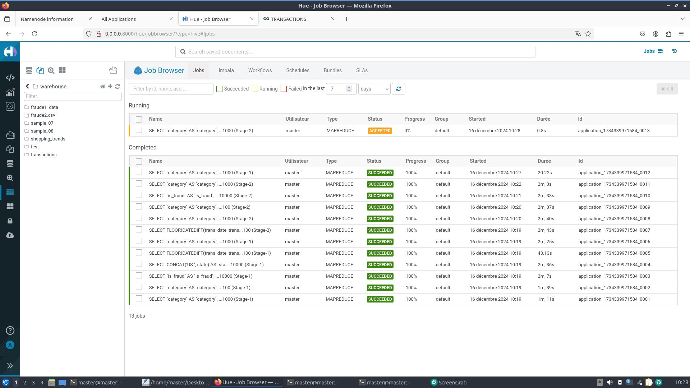
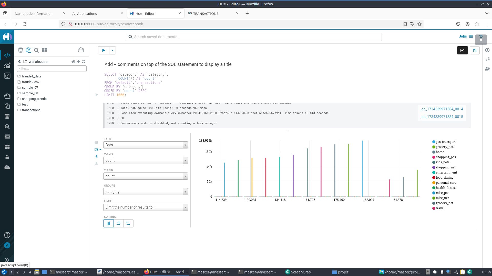
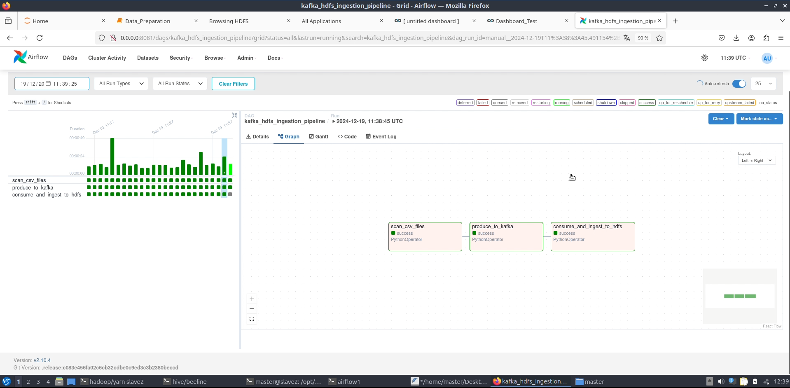

# 🚀 Big Data Pipeline for Real-Time Banking Transaction Analysis
## Kafka | Hadoop (HDFS) | Hive | Airflow | Superset | Hue | Zookeeper
---
## 📸 Project Overview
🔍 This academic project implements a Big Data pipeline enabling real-time ingestion, processing, analysis, and visualization of banking transaction data.



### Key Technologies:
- **Kafka** – Real-time ingestion
- **HDFS (Hadoop)** – Distributed storage
- **Hive** – SQL analysis of stored data
- **Airflow** – Pipeline orchestration
- **Hue** – Management and SQL querying on Hive
- **Superset** – Visualization and interactive dashboard creation
- **Zookeeper** – Coordination of Kafka and Hadoop services
---
## 📂 Project Architecture
### Data Flow:
1. CSV files are deposited in a monitored folder
2. Kafka ingests the files and transmits their paths
3. Airflow consumes the files and ingests them into HDFS
4. Hive loads files from HDFS into SQL tables
5. Hue enables SQL queries to analyze the data
6. Superset creates dynamic visualizations and dashboards
---
## 🎯 Project Objectives
- Automate massive data ingestion and processing
- Efficiently manage file storage via Hadoop HDFS
- Analyze transactions using Hive and SQL
- Visualize results via Superset to detect banking trends and fraud
---
## ⚙️ Technologies Used
| Technology  | Role                                             |
|-------------|--------------------------------------------------|
| **Kafka**   | Real-time streaming and ingestion                |
| **HDFS**    | Distributed storage of CSV files                 |
| **Hive**    | Data analysis and SQL queries                    |
| **Airflow** | Task orchestration and automation                |
| **Hue**     | Web interface for SQL queries on Hive            |
| **Superset**| Data visualization and dashboards                |
| **Zookeeper**| Kafka and Hadoop coordination                   |
---
## 🛠️ Installation and Deployment
The project is deployed on a cluster (1 master and 2 slaves). To get the necessary configurations:
```bash
git clone https://github.com/Dhia-69/TransactionAnalysis_RealTime 
cd TransactionAnalysis_RealTime
```
### Starting Services
Consult the **"Starting services.txt"** file to run the necessary services.
---
## 📊 Dashboard Examples and Technology Interaction
**Apache Superset Dashboard**


**Features and verification with Apache Hue**




**Apache Airflow Interface**

## 🚀 Pipeline Execution
1. **Kafka Producer**: Deposits CSV files in the monitored folder (`~/kafka_ingestion`).
2. **Kafka Consumer**: Consumes Kafka messages and moves files to HDFS.
3. **Hive**: Loads HDFS files and updates the Hive table.
4. **Superset**: Automatically visualizes new data through JDBC connection with Hive.
---
## 🎥 Video Demo
🔗 [https://drive.google.com/file/d/154iiTMNqWlyOTbEOYxhQxQMX98fD5USk/view?usp=sharing](#)
